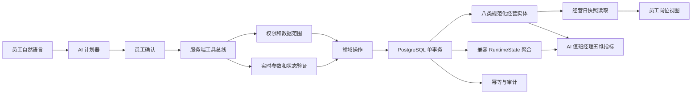

# AI 执行与经营数据架构

## 迁移原则

- `RuntimeState` 在过渡期继续承接旧页面合同，但不再是唯一可查询形态。
- 桌台、桌次、服务任务、订单、订单品项、KDS 出品、支付意图和库存余额八类高频实体同步投影为规范化表；投影与聚合共用数据库连接和事务。
- 员工端高频工作台按营业日从规范化表读取；旧桌次、旧订单、旧出品和旧支付不再混入现场页面，历史仍保留在聚合兼容层和分析数据中。
- 同一运行版本只执行一次规范化快照查询并在进程内复用；每名员工的权限视图继续独立生成，不能通过缓存越权看到其他岗位数据。
- 新报表、AI 指标和异步任务继续优先改读规范化表；旧业务按领域逐个迁移，禁止一次性重写全店系统。
- checkpoint 保存权威 revision、状态摘要和实体数量；它是新 revision 能否接流量的门禁之一。
- 服务端工具总线逐个收编高频按钮。没有进入总线的长尾功能仍可使用原页面，但模型不得把模拟点击结果当成业务完成。

## 一致性与兼容边界

- 每行的 `snapshot_revision` 表示该实体最后一次变化的运行版本，不要求未变化实体在每次整店 revision 增加时重复写入。
- 全局一致性由同一 PostgreSQL 事务中的聚合更新、实体增量投影和 checkpoint 提交保证；读取语句同时校验 checkpoint 与聚合 revision。
- 配置、权限和低频长尾领域暂时仍从 `RuntimeState` 兼容聚合读取。写入仍保留整店事务锁，避免验证阶段多实例并发产生部分成功；下一阶段按领域命令逐步迁移行级写入，不能直接拆锁破坏订单、支付、库存的一致性。
