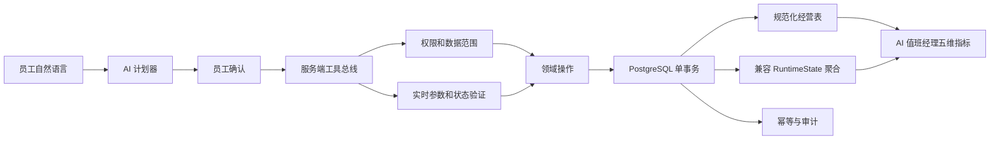

# AI 执行与经营数据架构

## 迁移原则

- `RuntimeState` 在过渡期继续承接旧页面合同，但不再是唯一可查询形态。
- 六组高频数据同步投影为规范化表；投影与聚合共用数据库连接和事务。
- 新报表、AI 指标和异步任务优先改读规范化表；旧业务按领域逐个迁移，禁止一次性重写全店系统。
- checkpoint 保存权威 revision、状态摘要和实体数量；它是新 revision 能否接流量的门禁之一。
- 服务端工具总线逐个收编高频按钮。没有进入总线的长尾功能仍可使用原页面，但模型不得把模拟点击结果当成业务完成。
