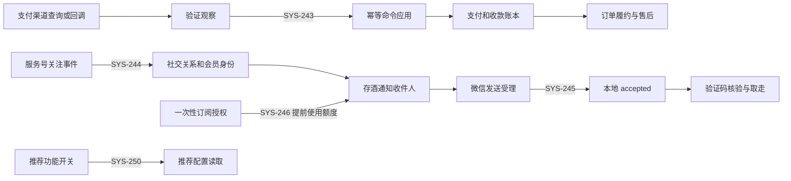

# M-BOX 系统代码、功能闭环与线上异常审计（2026-09-19）

审计结论：当前服务可用，已有回归检查大部分覆盖了模块内部行为，但跨模块接线、微信平台协议和后台任务失败上报仍有实质缺口。本轮登记 **4 项 P1、6 项 P2**，其中支付自动同步和后台图片慢请求有当前生产证据；服务号回调有历史生产失败及当前代码复现；其他存酒、推荐问题已在隔离环境确定性复现。不能据此认定系统所有商业流程已闭环。

本次完成审计与风险登记，未修改业务源码、部署、上传小程序、执行退款、改变库存、发出真实通知或打印。受控数据附录及可复现脚本保留在本工作树 `artifacts/system-audit-20260919/`，不作为公开仓库附件。本文的源码行号对应以下审计基线。

## 1. 基线与证据范围

| 项目 | 核实结果 |
|---|---|
| 独立工作树 | `mbox-system-audit-20260919`，分支 `audit/system-20260919`；原工作树保留 |
| 远端主线 | `5c283b3ced6c8ea8e410557a3ee2a451d9d5b5bc`；已 fetch 并确认 origin |
| 生产版本 | `1.0.0-rc.209`，提交 `6c076ddef187149f4081b57c5859e5dd7b8ea2bf`，schema `220` |
| 代码一致性 | 上述主线与生产提交之间仅有 3 份文档变化；本轮 `docker diff` 未发现应用源码热补文件 |
| 镜像身份 | OCI digest `sha256:0b2013e1858f65a3b37563b205108edf814fb2fb034f0038b9d3ae80dea60d65`；平台镜像 `sha256:e69f70ecce58ce143cf579bb00fa033b1192a49dc30ac005bfb1613afa3278a9` |
| 生产采集 | 2026-09-19 12:23—12:56 CST；数据库显式只读事务、门店作用域及查询超时 |
| HTTP 历史窗口 | 2026-09-18 08:00 至 2026-09-19 12:38 CST；另单独统计 rc.209 上线后至 12:45 的请求 |
| 本地验证 | 独立 PostgreSQL 16.13 容器、隔离测试数据库、浏览器和真实本地 HTTP；未向生产施压 |

P1 表示影响资金事实同步或阻断核心业务，应在对应功能正式验收前修复；P2 表示功能、性能、诊断或发布治理缺口。优先级不代表已发生资金损失。

## 2. 已确认问题及根因

| ID | 优先级 | 新旧属性 | 已证问题 | 证据级别 |
|---|---|---|---|---|
| SYS-243 | P1 | 旧代码持续存在 | 支付调度器拼接出 131 字符幂等键，命令层仅接收 128；同步失败未进入 worker 失败列表 | 当前日志、只读数据、真实命令执行器复现 |
| SYS-244 | P1 | 旧回调入口接线遗漏 | 服务号回调注册未传入 `handleEvent`，合法事件验签后仍返回 503 | 历史 42 次 503、当前源码、加密事件复现 |
| SYS-245 | P1 | 9 月 18 日新增订阅适配缺陷 | bizsend 标准成功回包不含 `msgid`，被判定为 `unknown`，存酒核验要求 `accepted` | 官方协议、适配器复现、核验 SQL |
| SYS-246 | P1 | 9 月 16 日测试逻辑进入业务入口，后扩展四模板 | 订阅成功自动发送固定示例通知，消耗一次性授权 | 页面与路由接线、假 provider 复现、官方授权语义 |
| SYS-247 | P2 | 存酒通知新增路径 | 查询同名 `expires_at` 覆盖，验证码提示使用存酒到期时间 | PostgreSQL 实测及 worker 源码 |
| SYS-248 | P2 | 旧异常映射遗漏 | 通知授权相关接口会话失效返回 500，丢失可恢复的认证错误码 | 当前 4 个 GET 只读探测、历史日志 |
| SYS-249 | P2 | 图片慢症状持续存在 | 员工图片请求 p95 11.31 秒；整库原图并发加载、重复鉴权和禁缓存放大开销 | rc.209 真实慢请求；贡献因素由源码确认，耗时分段待补 |
| SYS-250 | P2 | 8 月 29 日起潜伏 | 推荐配置以只读事务执行 `FOR KEY SHARE`，启用后报 PostgreSQL 25006 | 实际 repository + runner + PostgreSQL 复现 |
| SYS-251 | P2 | 旧诊断缺口 | 支付适配器异常统一替换为无 cause 的 `OnlinePaymentUnknownError` | 历史日志及异常边界源码 |
| SYS-252 | P2 | 9 月 17 日文档恢复引入 | 商业化清单历史大段中文乱码，影响需求、验收和责任追溯 | Git 前后版本和 blame |

### SYS-243：支付自动同步失败且健康检查漏报

`background-worker-coordinator.ts:480` 在基础 worker ID 后添加任务名；`stale-guest-immediate-payment-worker.ts:139` 再添加前缀和时间桶；`pending-online-payment-reconciliation.ts:48` 添加支付 UUID。生产基础 ID 长 17，最终键长 **131**，超过 `command-executor.ts:389` 的 **128** 上限。异常发生在进入命令数据库事务之前。

`payment-worker-probe.json` 使用真实 worker、支付命令服务和命令执行器复现了相同 TypeError，数据库进入次数为 0。调用链把这一失败标作 `query_provider`，实际上本例已取得渠道观察结果，失败发生在本地应用阶段。通用同步结果没有汇入 `failedPaymentIds`，调度器据此仍报告 `healthy`。

本次 rc.209 日志样本有 129 条相同错误；受控只读查询找到近期 2 笔支付的 428 条未消费 `payment_failed` 验证观察。未发现“已验证成功而本地仍非收款终态”的支付。不能把全部历史 pending/财务待核记录都归因于这个长度错误。

修复应使用有界、稳定且仍能绑定原命令/观察的幂等键；同步结果必须汇总到 worker 失败/退避与健康状态，并分开标记查询渠道、应用结果阶段。验收覆盖调度器真实 worker 名、失败/关闭/成功观察、重复运行和部分失败；不能简单截断造成键碰撞，也不能把失败观察改成成功。

### SYS-244：服务号回调验签与业务处理脱节

`normalized-app.ts:432` 注册 `wechatServiceAccountCallbackPlugin` 时仅传 `prefix`、`config`。`wechat-service-account-callback.ts:59` 在没有 `handleEvent` 时固定拒绝处理。`callback-probe.json` 的合法加密 subscribe 事件得到 503；仅在对照组补入处理器后得到 200。

另一条 `/api/social-accounts/:id/callback` 已有持久化入口，两者尚未接通。历史访问日志有 42 次固定入口 POST 503，符合此执行分支。12:56 的只读回读确认固定回调与订阅配置均启用，无签名 GET 返回 403，未提交生产事件。当前没有社交关系记录，说明相关依赖尚无成功闭环证据；不能仅由空表推断每次事件内容或实际关注人数。

修复选择：让固定入口依据受信任账号配置调用持久化处理器，或核对微信平台地址并切到对应账号入口。必须保留验签、账号绑定、重复事件去重、事务持久化及取关撤权；禁止直接返回 success 丢弃事件。现有测试明确覆盖“无处理器返回 503”，却没有检查主应用接线，这是集成覆盖缺口。

### SYS-245：订阅成功回执被错误拒绝

`social-account-adapter.ts:63–72` 的 bizsend 分支要求 `msgid`。微信官方[发送订阅通知文档](https://developers.weixin.qq.com/doc/service/api/notify/notify/api_sendnewsubscribemsg)定义的返回体及成功示例只有 `errcode`、`errmsg`。输入标准成功响应后，实际适配器输出 `unknown / MISSING_RECEIPT`。

`social-custody-worker.ts:89` 将该状态写回；`bottle-custody-repository.ts:128、140` 又要求 `delivery_status='accepted'` 才允许核验和取走。因此即使通知接口已接受，业务仍可能拒绝正确验证码。线上目前没有存酒业务记录，本轮没有发送真实消息，不能宣称发生了顾客收码失败事故。

按该接口实际契约判断受理成功；区分平台已受理与用户已收到，保存可审计的本地发送身份，不伪造微信 msgid。为 sendSubscribe 添加成功无 msgid、平台拒绝、超时未知的契约检查，并联验核验/取走。官方页面中跳转参数表与请求示例存在不一致，当前代码未使用 `miniProgramAppId`；跳转正确性保留真机验证，不列为已证协议错误。

### SYS-246：授权后自动发送示例占用额度

`wechat-service-account-subscribe.ts:399–415` 在开放标签 success 事件后直接调用 `/subscribe/send-test`；`buildBizSendBody:245–300` 使用固定验证码、示例存酒单/品名及活动、优惠数据。旧 `/subscribe/result` 也会直接发送，应一起收口。

微信官方[订阅通知介绍](https://developers.weixin.qq.com/doc/offiaccount/Subscription_Messages/api.html)说明，一次性订阅允许每次授权下发一条对应通知。已授权四模板时逐个成功发送示例，会使用各模板额度；若无额外剩余额度，后续真实验证码或到期提醒缺少发送机会。`social-probe.json` 以假 provider 确认无需任何真实存酒单就发出示例请求，审计未向微信发送。

正式授权只记录实际授权结果并关联业务身份，额度留给真实事件；测试发送应有独立、明确的管理入口及测试账号。验收覆盖授权后无业务不发送、真实事件只发一次、重复授权/撤销、配额不足和未知回执。此项与 SYS-244、245 是独立阻断点，修复任意一项都不能单独关闭 SYS-239。

### SYS-247：验证码有效期文案取错列

`social-custody-worker.ts:57` 选择 `j.*` 后又选择 `o.expires_at::text`。node-postgres 将同名列映射到对象时后列覆盖前列，`:69` 计算的是存酒保管期。隔离查询中，实际 5 分钟验证码的文案计算为 131040 分钟。数据库验证码真实过期判断仍使用 challenge 表，因此问题是错误提示，不是验证码有效期被放宽。

明确区分 `challenge_expires_at` 与 `custody_expires_at`，覆盖分钟边界、已过期及保管期变更；不能靠缩短保管期规避。

### SYS-248：失效会话误报服务器故障

当前四个未认证 GET（通知提示、普通授权、会员服务授权、演出授权）均返回 500 和“预约会话已失效”；普通推荐配置入口同条件返回 401。相关路由在错误映射外直接调用 `resolvePublicContext`，全局处理器只特别处理非法 JSON，未统一认证异常。

`wechat-loyalty-notification-api.ts:32`、`wechat-member-service-notification-api.ts:22`、`reservation-performance-notification-api.ts:30` 是入口证据；`normalized-app.ts:312` 是公共边界。小程序 `utils/auth.js:60` 依赖 401 或明确认证码进行恢复，当前返回不能可靠触发该分支。历史窗口四类 GET 合计 31 次 500；其他路由的 500 不并入此根因。

统一映射认证异常为 401 和稳定码，权限不足为 403；保留真正内部故障为 500。验证 GET/POST、缺凭证、过期凭证、有效凭证和小程序重登路径。

### SYS-249：后台图片库是当前明确慢点

rc.209 单独窗口内，员工图片读取 **3356** 个成功请求：p50 **2.57 s**、p95 **11.31 s**、p99 **16.12 s**；列表 122 次，p95 **2.07 s**。公共图片 98 次，p95 158 ms。以上是代理记录的请求耗时，包含传输及客户端读取影响，不等于纯数据库执行耗时，也不是页面首屏时间。

`MediaAssetPicker.tsx:59` 为列表每项立即加载原图，没有懒加载；repository 先取最新 100 条再由前端按用途筛选，没有分页。`media-asset-api.ts:66–75` 每张图片走员工认证、权限事务和读取字节事务，响应 `private, no-store`。这些是可见的请求放大因素，不能在缺少逐段 trace 时把 16 秒全部归因于 SQL。

建议按用途在服务端分页、使用缩略图与可见范围懒加载、限制加载并发，并在保持权限隔离的前提下设计私有缓存/条件请求。补齐认证、等连接、查询、发送字节的分段计时，再决定池大小；仅扩连接池可能增加数据库争用。验收应测员工真实图片库及弱网，不能用公共缩略图优化代替。

### SYS-250：推荐开关启用后的只读事务冲突

`customer-experience-service.ts:2396–2400` 开启只读事务，repository `:3919–3931` 加 `FOR KEY SHARE`。`recommendation-probe.json` 使用实际事务执行器与实际 repository，在 PostgreSQL 中得到 **25006 / cannot execute SELECT FOR KEY SHARE in a read-only transaction**；相同数据的读写事务对照通过。

生产 `recommendation.engine=disabled`，所以历史 383 次配置 503 符合未启用分支，而非此行锁异常。小程序补充加载仍请求推荐配置，形成噪声。修复时分离无锁配置读取与需要锁的提交路径，保留推荐创建的一致性；使用 enabled/pilot/disabled 三类真实数据库夹具验证。

### SYS-251：支付不确定性边界抹掉诊断原因

`online-payment-service.ts:1210–1222` 把适配器的非预期错误替换成没有 cause 的 `OnlinePaymentUnknownError`。两份既有容器日志合计 9668 条此类记录，现有证据不能进一步区分超时、网络、渠道业务拒绝或解析错误。

保留资金事实“未知”是正确的，缺陷在于诊断信息丢失。应增加经过脱敏的原始错误分类、操作阶段、关联 ID 和超时/渠道码，控制采样与重复日志。不能依据“未知”擅自认定未扣款、重新收款或执行退款。

### SYS-252：历史清单编码损坏

提交 `b948d4a` 之前的清单标题为正常中文；该提交恢复截断文档时引入当前大量乱码，后续追加部分正常。本轮仅更新最后更新时间及追加可读风险表，保留原历史字节，不做不可逆的猜测转码。

应从 Git 中最后正常段落恢复，逐条核对编号、责任人、完成条件和变更记录；对后续新增记录做有依据的合并，并增加 UTF-8/典型乱码检查。清单失真会使旧风险在发版和验收中被漏掉。

## 3. 功能依赖与闭环判断

| 业务域 | 本轮覆盖 | 仍未闭环或不能据此关闭 |
|---|---|---|
| 点单、支付、退款、数量售后 | 全量数据库回归；本地 HTTP 链路；收款/退款账本及超额检查；支付日志到执行器复现 | SYS-243；历史财务待核不能批量消除；真实渠道退款另需授权与回执 |
| KDS、服务待办、库存、盘点 | 本地并发/幂等及浏览器回归；库存余额对流水；闭桌残留任务与自审检查 | 有存量待复核成本和已过时盘点；后者须退回重盘，不能直接覆盖新库存 |
| 会员、权益、社交账号、存酒 | 默认及扩展浏览器夹具；身份、发送、核验源码依赖；平台协议核对 | SYS-244—247；新旧会员迁移规则须照既定要求验收；空表/页面可见不能证明真实使用 |
| 微信与支付宝前端 | 完整 check 中两端静态/逻辑/发布契约检查；微信旧问题补充脚本 | 未运行原生真机、微信体验版/正式版回读或支付宝平台验收 |
| 权限及数据隔离 | 现有认证/角色/跨门店数据库回归；抽查 7 个关键表启用并强制 RLS；只读未认证探测 | 非穷举渗透测试；本轮未授权真实员工改角色或审批盘点 |
| 性能稳定性 | 线上路由分组、连接池指标；隔离 HTTP 压测；浏览器回归 | SYS-249；混合营业高峰、弱网、长时间浸泡、故障恢复演练仍缺本轮证据 |
| 日志与运维发布 | 运行镜像/源码身份、重启、磁盘；版本分段日志；发布策略及 Linux shell 测试 | SYS-251；SYS-242 发布依赖预检仍开放；未重做备份恢复及 OSS 验证 |
| 打印硬件 | 后台状态只读回读及既有测试覆盖；对照 rc.209 发布记录 | 现场桥仍回报 1.0.9，1.0.10 安装、字库、纸宽和实体三状态票仍归 SYS-241 |

## 4. 新旧问题复核及异常归因边界

| 事项 | 当前判断 |
|---|---|
| 9 月 14 日跨设备登录限流、慢账单耦合、JSON 400、协议匿名读取、小池嵌套事务 | 修复仍在主线；本轮相关回归通过。认证错误遗漏 SYS-248 是剩余问题，不能混同为已修复的非法 JSON 回归 |
| Vitest 开发依赖漏洞 | 本轮全依赖 `npm audit` 为 0 项；只说明当前依赖公告结果，不代表业务安全无缺陷 |
| 9 月 18 日入会 500 | 历史窗口 8 次，早于当日合并顺序及 outbox 修复完成；当前镜像已含修复。rc.209 窗口无该 500，未重新发起真实入会，因此不宣称真机身份体验全部通过 |
| 既有 20 元退款记录 | 已在历史需求中明确“已处理、不重开”；本轮账本残留仅在受控附录注明。未重开退款、补写资金事实或把它列为新事故 |
| 既有取消订单与已收款并存 | 保留订单状态、资金事实、后到款跟进的独立口径；受控附录指向原事项，不据此自动退款或认定重复扣款 |
| 发布机缺浏览器依赖 | rc.194 与 rc.209 都在切换后发现并回退，属于复发的流程缺口；沿用 SYS-242，不因后来手工补依赖而关闭 |
| 存酒到期改订阅通道 | 代码/配置已具备不等于送达闭环；SYS-239 持续开放，并依赖 SYS-244—247 |
| 打印新包与现场安装 | 后台 rc.209 已运行；现场桥 1.0.9。安装/实物验收仍开放，未依据候选包或哈希冒充门店完成 |

历史 Caddy 5xx 共 485 次：推荐配置 383 次 503、固定服务号回调 42 次 503、其他 41 次 500、19 次 502。19 次 502 包括打印桥/健康入口共 18 次上游不可达，以及 1 次订阅 OAuth 失败；现有证据不支持把它们全部归为数据库问题。

rc.209 独立 HTTP 窗口未见外部 5xx，但同期支付 worker 仍报错。后台异步任务不经过 Caddy，所以 HTTP 错误率低不等于资金同步健康。4 个只读认证探测直接访问容器，是本轮新增探测证据，不混进历史公网请求统计。401/403 可由正常权限保护产生；344 次 404 的具体请求需单独看来源，本轮不自动认定为核心业务故障或攻击成功。

## 5. 性能与稳定性证据

生产快照：应用容器 RestartCount 为 0，CPU 1.29%，内存约 98 MiB；宿主磁盘使用 58%，余量约 40 GB。数据库约 276 MB；采集时无明显锁等待。数据库统计有历史累计 4 次 deadlock，不能当作本轮 4 次新故障。镜像未见源码热补，不代表所有运维流程均已验收。

应用连接池上限 5、worker 池 4。指标窗口内池获取 p95 666 ms、p99 747 ms，查询 p95 4.31 ms、p99 16.36 ms，获取失败为 0；提示应关注排队与请求放大，但两个耗时样本不是逐请求对应，不能直接相减认定单一根因。大包构建警告仍在，需要结合真机首屏数据决定优化收益。

| 隔离 HTTP 场景 | 实际请求数 | 错误数 | p95 / p99 |
|---|---:|---:|---|
| 开桌 | 100 | 0 | 35.00 / 36.67 ms |
| 下单 | 100 | 0 | 87.75 / 94.05 ms |
| KDS 领取与完成 | 200 | 0 | 57.31 / 64.05 ms |
| 服务任务流程 | 400 | 0 | 27.64 / 31.65 ms |

配置为每场景 5 RPS、20 秒、顺序独立执行，最大观测并发均为 **1**。这是端点级真实 HTTP + PostgreSQL 证据，**不能证明营业高峰混合负载达标**。本地数据库在 ARM 主机运行 amd64 镜像，延迟不能直接外推生产容量；worker 关闭带来的测试 outbox 留存不是生产积压。

## 6. 验证记录

| 检查 | 结果及限制 | 本地证据 |
|---|---|---|
| `npm ci`、完整 `npm run check` | 复跑退出 0；含架构、TC、两端小程序契约、类型、lint、测试和构建 | `npm-ci.log`、`check-recheck.log` |
| 常规 Vitest | 1865 通过 / 747 条件跳过；256 文件通过 / 76 跳过 | `check-recheck.log` |
| 独立 PostgreSQL 全量 | 2273 通过 / 1 条件跳过 | `postgres.log` |
| 默认浏览器 | 78 通过 / 13 条件跳过 | `browser.log` |
| 会员卡、赠品、营销、V9 扩展浏览器 | 开启扩展夹具后 8 通过；覆盖指定 4 个文件 | `browser-extended.log` |
| 发布配置/策略 | 配置 Vitest 30、生成器 1、策略/演练 Node 35 通过 | `release-system.log`、`release-policy.log` |
| Linux 发布锁/状态/env 脚本 | macOS 首跑缺 Linux 工具；专用 Linux 容器补齐 jq 后 3 个脚本退出 0 | `release-shell-linux-recheck.log` |
| 全依赖公告审计 | 0 已知漏洞 | `dependency-audit.json` |
| 微信旧问题补充 | 审计修复脚本通过 | `old-issues-mini.log` |
| 新缺陷复现 | 支付键、回调接线、订阅回执/自动示例/列名覆盖、推荐只读锁 | `*-probe.mjs`、`*-probe.json` |

首次完整 check 在 mock 压测的“创建输出目录”测试失败：仅 2 个请求、0.4 秒窗口却套用 5 RPS × 98% 门槛，实际发起 4.87 RPS，模拟业务请求全部成功。隔离重跑该 9 项测试及完整 check 均通过，源码未变。原失败日志保留；这提示计时测试对调度敏感，不作为生产性能不达标证据，也不删除原失败记录。建议文件 I/O 断言与真实负载门槛分开。

不同套件互有覆盖，数字不可相加成“独立验收总数”。浏览器条件跳过、原生端和真实渠道仍按各自边界处理。

## 7. 修复顺序与关闭条件

1. **先恢复支付可观测同步**：SYS-243 的有界幂等、结果汇总和分阶段错误；只对有渠道证据的记录按既有命令恢复，核对一次收款/退款账本。SYS-251 同步补诊断，禁止批量猜测终态。
2. **一次打通服务号到取酒链路**：SYS-244—247 联合处理，依次验证回调持久化、身份关联、授权留存、平台受理、正确/错误/过期验证码、取走及到期提醒。修复后仍需真实测试账号和门店验收，继续关联 SYS-239。
3. **处理当前体验及启用风险**：SYS-248 认证恢复、SYS-249 图片库分段优化、SYS-250 推荐开关数据库检查；每项使用针对性的跨层验证，避免仅修改 mock。
4. **消除旧问题复发条件**：SYS-242 把依赖和浏览器启动前置到生产变更前；SYS-252 从 Git 证据恢复清单。扩展测试需进入实际执行门禁，不能只存在于可跳过文件。

本轮不把代码修复、CI、后端部署、小程序上传、微信平台状态、真机使用及实体票/现场验收合并为一个“已完成”。详细责任、目标及关闭证据见商业化清单新增 SYS-243—252；既有 SYS-202、SYS-239、SYS-241、SYS-242 继续开放。审计专用本地 PostgreSQL 容器已停止并移除，其他容器未改动；证据和扩展浏览器报告已保留。
